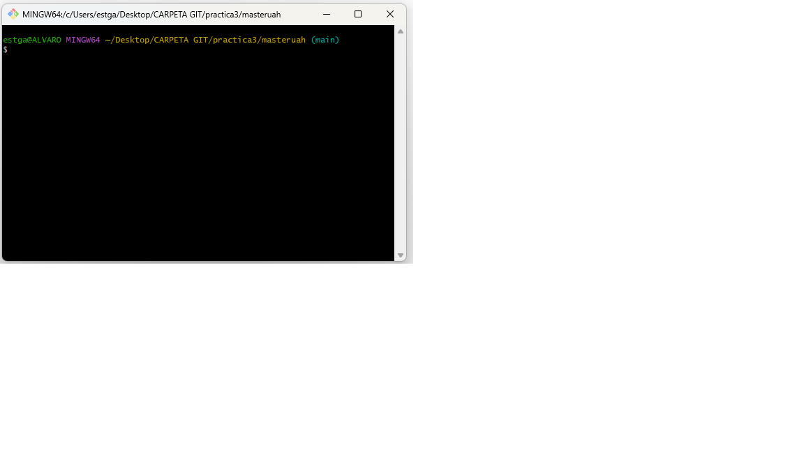

# masteruah

<ol>
    <li>
        git clone
    </li>
</ol>

<table>
    <tr>
        <th>NOMBRE</th>
        <th>GITHUB</th>
    </tr>
    <tr>
        <td>ejemplo</td>
        <td>ejemplo</td>
    </tr>
</table>
